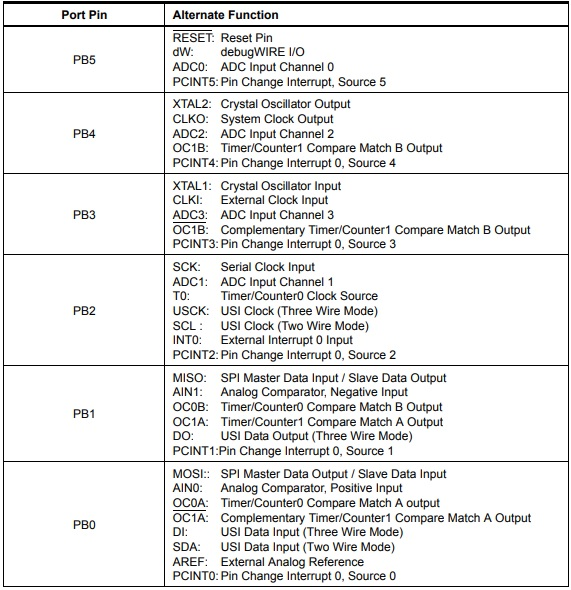

# ATtiny85

ATtiny85 - 8-bit AVR Microcontroller

The ATtiny85 Microcontroller is one of the smallest Microcontrollers available today. It is an 8-bit Microcontroller with 8 physical pins, based on the AVR RISC Architecture.

There are three variants of ATtiny85: ATtiny25, ATtiny45 and ATtiny85. The main difference between these three ICs is the amount of memory each device has (Flash, EEPROM and RAM).

The ATtiny85 has 8KB of In-system programmable Flash, 512B of EEPROM and 256B of SRAM.

## Pin Diagram of ATtiny85

The ATtiny85 is an 8-pin Microcontroller and the most common IC package for ATtiny85 is the 8-pin SOIC. The following image shows the Pin Diagram of an 8-pin SOIC ATtiny85.

From the above pin diagram, you can observe that except for VCC and GND, rest of the 6-pins of ATtiny85 are multiplexed with multiple functionalities.

### Pin Description
**VCC:** It is the supply voltage pin. For ATtiny85 running at a speed of 10-20MHz, the supply voltage should be in the range of 2.7V – 5.5V.

**GND:** Ground Pin

**PORTB (PB0 – PB5):** The rest of the 6-pins in ATtiny85 are Port B Pin. Port B is a 6-bit I/O Port. All the 6 port B have multiplexed operations with each pin capable of handling 3 or more operations.

**RESET:** It is multiplexed with PB5. It is an active LOW pin.

The following image shows the list of alternative functions on the PORTB pins.

Here is a simplified overview of the pin diagram of the ATtiny85.

You can also view the [datasheet of the ATtiny85](http://ww1.microchip.com/downloads/en/DeviceDoc/Atmel-2586-AVR-8-bit-Microcontroller-ATtiny25-ATtiny45-ATtiny85_Datasheet.pdf).

## Development

Developing on the the ATtiny85 is similar to development on the Arduino boards, with some limitations.

We can use the Arduino IDE to program the the ATtiny85. Se the [installation instructions](#installation).

### Hello World / Blink

In the realm of microcontrollers, the 'Hello World' equivalent is a simple 'Blink' program, which simply toggles the state of an LED indefinetily.

The following sketch toggles an LED connected to pin PB1 (physical pin 6, see the [pinout diagram](#pin-diagram-of-attiny85)).

### Basic statements

*Coming soon*

### Advanced statements

*Coming soon*

### Interrupts

*Coming soon*

#### External interrupts

*Coming soon*

#### Timer interrupts

*Coming soon*

### Sleep / Low-Power

*Coming soon*

## Installation

Setting up Arduino IDE
The first step is to setup Arduino IDE for programming ATtiny85. Open your Arduino IDE and go to Preferences. In the tab that says “Additional Boards Manager URLs”, copy and paste the following link and click on **OK**.

> `https://raw.githubusercontent.com/damellis/attiny/ide-1.6.x-boards-manager/package_damellis_attiny_index.json`

Now, go to Tools → Board: → Board Manager… and search for “Attiny”. Select the one by **David A. Mellis**. If the installation is successful, you can see the board in Tools → Board → ATtiny Microcontrollers.

## Programming the ATtiny85 with Arduino

### Hookup

Regardless of which Arduino you want to use as ISP (In-System-Programmer), you must prepare the Arduino as an ISP, by uploading the ISP sketch to it.

In the Arduino IDE select File → Examples → Arduino ISP → ArduinoISP

the ISP sketch should open, upload it to your Arduino board of choice.

#### Arduino Uno as ISP

Wire the connection between the Arduino Uno (ATmega328P) and ATtiny85 as follows:

| Arduino Uno | ATtiny85 |
| ----------- | -------: |
| 5V          |      Vcc |
| GND         |      GND |
| Pin 13      |    Pin 2 |
| Pin 12      |    Pin 1 |
| Pin 11      |    Pin 0 |
| Pin 10      |    Reset |

The use of an electrolytic capacitor is in order to prevent the Arduino from restarting itself. The capacitor is connected to GND & RESET on the Arduino, and a 10uF capacitor is recommended, but higher values can also be used.

#### Arduino Mega 2560 as ISP

*Coming soon*

#### Arduino Nano as ISP

*Coming soon*

### Bootloader

Before we can upload any code to the ATtiny85, we first need to burn the bootloader. This is only neccessary if there is no bootloader present (i.e. when the chip is new), or you want to burn a new bootloader (for example changing the internal clock speed).

When you hooked up your Arduino board to the ATtiny85 as described [above](#hookup), and uploaded the ArduinoISP-sketch to the Arduino board, you can burn the bootloader to the ATtiny85.

1. Tools → Board → ATtiny25/45/85
2. Tools → Processor → 8 MHz (internal)
3. Tools → Programmer → Arduino as ISP
4. Tools → Burn bootloader

A message will appear saying "Done Burning Bootloader". Now you can start [uploading sketches](#uploading-sketches).

### Uploading sketches

When uploading sketches, the settings should be the same as the burned bootloader, as described [above](#bootloader).

1. Tools → Board → ATtiny25/45/85
2. Tools → Processor → 8 MHz (internal)
3. Tools → Programmer → Arduino as ISP

And then upload the sketches, by pressing "Upload". You can use the simple [Blink](#hello-world--blink) (Hello World) sketch as a starting point, and continue reading the [development section](#development).

## Resources

- http://ww1.microchip.com/downloads/en/DeviceDoc/Atmel-2586-AVR-8-bit-Microcontroller-ATtiny25-ATtiny45-ATtiny85_Datasheet.pdf
- https://www.electronicshub.org/getting-started-with-attiny85/
- https://github.com/damellis/attiny
- http://highlowtech.org/?p=1706
- https://www.instructables.com/How-to-Program-an-Attiny85-From-an-Arduino-Uno/
- https://create.arduino.cc/projecthub/arjun/programming-attiny85-with-arduino-uno-afb829
